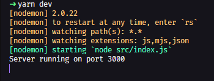
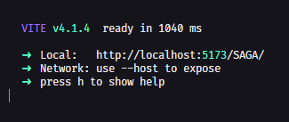

<!-- Banner SAGA -->
<div align="center">
	
  
</div>
<br>
<div align="center">
	
</div>
<br>
<div align="center">
<p align="center">  </p>

<h3 align="left">Connect with me:</h3>
<p align="left">
</p>

  
  
</div>

<!-- Información principal -->
# SAGA

SAGA es un proyecto formativo, con el objetivo de lograr una mejor gestión en la toma de asistencias, también cuenta con un apartado de noticias y prestamos para la biblioteca

<!-- Stack utilizado -->
## Tech Stack

**Client:** <br>
<a href="https://react.dev/" target="_blank" rel="noreferrer"> </a>
<a href="https://es.redux.js.org/" target="_blank" rel="noreferrer"> </a>
<a href="https://getbootstrap.com" target="_blank" rel="noreferrer"> </a>

**Server:** <br>
<a href="https://nodejs.org/es" target="_blank" rel="noreferrer"> </a>
<a href="https://expressjs.com/" target="_blank" rel="noreferrer"> </a>
<a href="https://www.mysql.com/" target="_blank" rel="noreferrer"> </a>
<a href="https://www.mongodb.com/es" target="_blank" rel="noreferrer"> </a>

## Deployment


<p>
  En este proyecto es posibles utilizan yarn como npm.
</p>

### 🐱‍💻Back-end
<p>
  Para ejecutar el servidor primero entramos al directorio raíz del <a href="./backend/">backend</a> 
</p>

<p>
  Estando acá instalamos las dependencias de yarn/npm
</p>

```bash
  yarn install
```
<br>

**Desarrollo**
<p>
  Si se utiliza en desarrollo utilizaremos:
</p>

```bash
  yarn dev
```

<div align="center">
	
</div>

<br>

**Producción**
<p>
  Y para producción utilizaremos:
</p>

```bash
  yarn star
```
---
### 💻Front-end
<p>
  Para ejecutar la vista entraremos al directorio raíz del <a href="./frontend/">frontend</a> 
</p>

<p>
  Estando acá instalamos las dependencias de yarn/npm acá utilizamos <a href="https://vitejs.dev/">vite</a>
</p>

```bash
  npm install
```
<br>

**Desarrollo**
<p>
  Si se utiliza en desarrollo utilizaremos:
</p>

```bash
  npm run dev
```
<div align="center">
	
</div>

<br>

**Producción**
<p>
  Y para producción utilizaremos:
</p>

```bash
  npm run deploy
```


<!-- Autores del proyecto -->
## Autores

- [@JuanDiego-Arenas](https://juandiego-arenas.github.io/portfolio/)
- [@JuanferGG](https://github.com/JuanferGG)
- [@XH0PE](https://github.com/XH0PE)

<!-- Documentación oficial -->
## Documentación Oficial

[Documentación v1.9](https://docs.google.com/document/d/1kZ9EadnyI-J2SxvlJGsE3FNvKyZrG7BQ/edit?usp=sharing&ouid=103677181091693336183&rtpof=true&sd=true)
